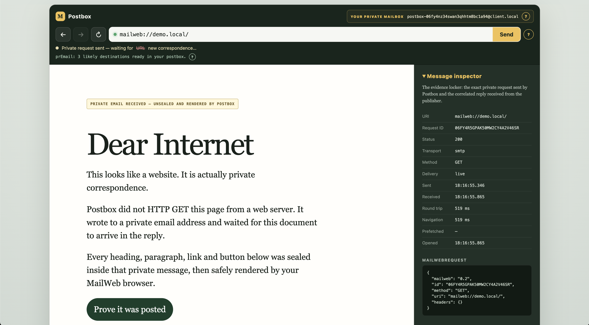

# MailWeb

> **What if browsing the web was technically just checking your email?**

MailWeb is a deliberately absurd experiment in transporting web-style documents as private messages instead of serving them directly as HTTP responses.

It is **not an attempt to replace HTTP**, nor a claim that routing a website through email magically places it beyond regulation. Quite the opposite: MailWeb exists to explore — and gently make fun of — how blurry the boundaries between a "website", a "message", and a "protocol" become when you separate content from its transport.

A page still feels like a normal website to the person browsing it. Underneath, however, every navigation is correspondence: the client sends a message requesting a document, the publisher replies with another message, and the client renders the response.

Yes, this means the demo genuinely browses a website through email.

Yes, this is ridiculous.

**That's the point.**

This repository proves complete static and dynamic round trips and deliberately keeps their machinery visible:



This repository proves complete static and dynamic round trips and deliberately keeps their machinery visible:

```text
Client -> message transport -> Laravel publisher -> message response -> client renderer
terminal   Go postbox          demo-site          JSON document       Go postbox
```

MailWeb messages are independent of their carrier. This repository now provides two development transports behind the same interface: a direct synchronous HTTP exchange and an SMTP exchange through Mailpit. The application contract remains only the request and response documented in [`packages/protocol`](packages/protocol).

## Repository layout

- `apps/postbox` — Go graphical and terminal clients, transports, protocol validator, and renderers
- `apps/demo-site` — ordinary Laravel application consuming the public package API
- `packages/protocol` — protocol notes, JSON Schema, and examples
- `packages/laravel-mailweb` — reusable Composer package implementing MailWeb 0.2 for Laravel
- `extension` — placeholder for a future browser extension; it is intentionally not implemented

## Browse locally

Docker and Docker Compose are the only host requirements.

### Graphical Postbox

Start the graphical browser with SMTP as its carrier:

```bash
./postbox-ui
```

Open <http://127.0.0.1:9847>, enter `mailweb://demo.local/`, and press **Send**. Every live graphical navigation travels out and back through Mailpit. Visit `mailweb://demo.local/hello` to send a semantic form as a real MailWeb POST and receive Laravel's personalized reply.

The browser includes back, forward, reload, safe structured document and form rendering, and a message inspector showing the exact request, response, method, body, timing, delivery source, status, and transport.

It also demonstrates **prEmail**, optional speculative correspondence. After a user-opened page renders, Postbox may send up to three same-origin GET links ahead through the selected transport and retain their replies in memory for 60 seconds. Opening one is instant, while the inspector honestly shows the earlier SMTP round trip and its request ID. Forms, buttons, POST, cross-origin targets, recursion, and reload are excluded. This behavior is visible because speculative requests have privacy implications: they disclose interest in pages the user may never open.

Set `MAILWEB_UI_TRANSPORT=http` when launching to use the direct development carrier instead.

### Terminal Postbox

Launch the terminal postbox with a MailWeb URI:

```bash
./postbox mailweb://demo.local/
```

Enter a displayed number to navigate between the demo documents, or `q` to quit. The launcher starts the Laravel publisher automatically. To inspect the publisher directly:

```bash
curl -s http://localhost:8081/mailweb/messages \
  -H 'Content-Type: application/json' \
  -H 'Accept: application/json' \
  -d @packages/protocol/examples/request.json
```

The command above uses the original direct HTTP development transport. To make every navigation travel out and back as actual email through SMTP:

```bash
./postbox --transport smtp mailweb://demo.local/
```

Postbox prints `Waiting for the publisher to reply...` while polling its generated mailbox. Browse the underlying request and response emails in Mailpit at <http://localhost:8025>. The default reply timeout is 15 seconds and can be changed with `--timeout`, for example `--timeout 30s`.

The publisher's HTTP port is exposed only as a local debugging convenience. Normal browsing goes through the terminal postbox.

Both carriers implement the small Go `Transport` interface in `apps/postbox/cmd/postbox/transport.go`. HTTP endpoints, SMTP addresses, MIME headers, and Mailpit polling never appear in MailWeb request or response objects.

## Local development

Compose bind-mounts `apps/postbox` at `/app` in the Go container and `apps/demo-site` at `/app` in the Laravel container. Each `./postbox` invocation compiles the current Go source. Laravel reads PHP files on each request.

Laravel's generated `vendor` directory is kept in the Docker-managed `demo-site-vendor` volume instead of being written into the repository.

## Scope

There is intentionally no database, queue, event bus, persistent cache, authentication, encryption, service discovery, or orchestration beyond Compose. prEmail's deliberately primitive cache lives only in one Postbox process and expires entries after 60 seconds.
